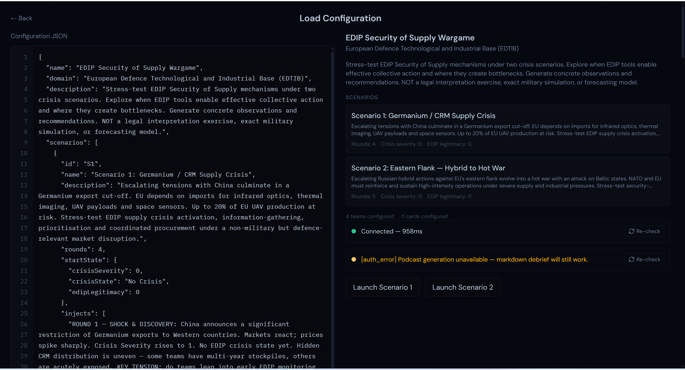
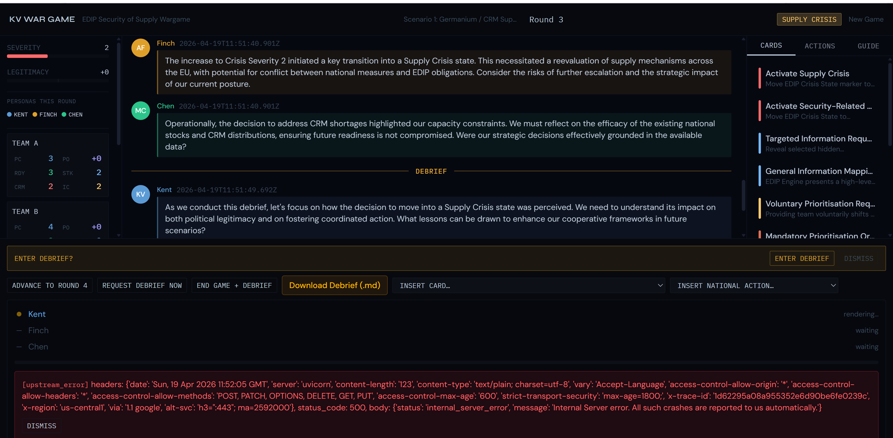

<objective>
Produce the primary SC3 evidence artifact: an empirical run that (a) flips `ELEVENLABS_API_KEY` to garbage in `.env`, (b) runs a full game to end-of-debrief in the browser, (c) clicks Generate Podcast, (d) confirms the error banner renders `[auth_error]` + the setup badge shows amber, and (e) confirms the Download Debrief (.md) button still downloads valid markdown with no regression.

Purpose: This is the load-bearing proof of v1.2's graceful-degradation promise — "the markdown debrief path continues to work unchanged when ElevenLabs is broken." Without this evidence, PODRES-01 is a claim, not a verified truth. Mirrors the v1.1 Tier-B precedent at `.planning/phases/12-*/12-LIVE-VERIFICATION.md` (written-test evidence, not video).

Output: `15-VERIFICATION.md` with screenshots, file hashes, and reproduction steps committed to git as the milestone audit artifact.
</objective>

<execution_context>
@C:\Users\taylo\.claude/get-shit-done/workflows/execute-plan.md
@C:\Users\taylo\.claude/get-shit-done/templates/summary.md
</execution_context>

<context>
@.planning/PROJECT.md
@.planning/ROADMAP.md
@.planning/STATE.md
@.planning/REQUIREMENTS.md
@.planning/phases/15-tts-health-graceful-degradation/15-CONTEXT.md
@.planning/phases/15-tts-health-graceful-degradation/15-RESEARCH.md

# Dependencies — both must be shipped
@.planning/phases/15-tts-health-graceful-degradation/15-01-SUMMARY.md
@.planning/phases/15-tts-health-graceful-degradation/15-02-SUMMARY.md

# Precedent template for the evidence doc shape
@.planning/phases/12-crisis-state-prompt-engineering/12-LIVE-VERIFICATION.md
</context>

<tasks>

<task type="auto">
  <name>Task 1: Scaffold 15-VERIFICATION.md + evidence directory + reproduction script</name>
  <files>
    .planning/phases/15-tts-health-graceful-degradation/15-VERIFICATION.md
    .planning/phases/15-tts-health-graceful-degradation/evidence/.gitkeep
  </files>
  <action>
**Step 1 — Check for the v1.1 precedent template:**

```
ls .planning/phases/12-*/12-LIVE-VERIFICATION.md
```

If present, read it to understand the expected document shape. If the file uses a different name (e.g. `12-VERIFICATION.md`), use whichever exists as the template.

**Step 2 — Create `.planning/phases/15-tts-health-graceful-degradation/evidence/.gitkeep`** (empty file) to ensure the directory is committed even before images land.

**Step 3 — Scaffold `.planning/phases/15-tts-health-graceful-degradation/15-VERIFICATION.md`** with the following structure (fill in the values during the checkpoint; the scaffold is written first so the checkpoint has a clear target to populate):

```markdown
# Phase 15 — Graceful Degradation Verification

**Date:** {fill in at checkpoint}
**Requirement:** PODRES-01 (structural + empirical)
**Success Criterion:** SC3 (garbage-key run) + SC4 (mid-gen failure — engineering-layer proof in 15-02)
**Precedent:** `.planning/phases/12-*/12-LIVE-VERIFICATION.md`

## Setup

- Backend: commit `{git rev-parse HEAD at time of run}`
- Frontend build: `pnpm dev` running on http://127.0.0.1:5173 (or configured port)
- Backend server: `uvicorn app.main:app --reload` running on http://127.0.0.1:8000
- `.env` configuration at time of run:
  ```
  TTS_PROVIDER=elevenlabs
  ELEVENLABS_API_KEY=badkey123
  ELEVENLABS_VOICE_KENT={fill in}
  ELEVENLABS_VOICE_FINCH={fill in}
  ELEVENLABS_VOICE_CHEN={fill in}
  ```
- Scenario config: {which config was loaded — e.g. Scenario-2 from v1.0 fixture}

## Reproduction Steps

1. Set `.env` as above (garbage ELEVENLABS_API_KEY; voice IDs can be dummy strings since no TTS call will succeed)
2. Start backend: `cd backend && uvicorn app.main:app --reload`
3. Start frontend: `pnpm dev`
4. Navigate to http://127.0.0.1:5173 and load a configuration
5. **Observation A — Setup-screen badge:** Confirm the TtsHealthBadge shows amber dot + text `[auth_error] Podcast generation unavailable — markdown debrief will still work.`. Confirm Launch button remains enabled.
   - Evidence: `evidence/setup-badge-amber.png`
6. Click Launch. Play through a full game to end-of-debrief. (If a faster path is available via an existing test fixture, document it.)
7. Click **End Game + Debrief**. Wait for the debrief_divider to render.
8. Click **Generate Podcast**.
9. **Observation B — Podcast error banner:** The GenerationPanel error banner renders `[auth_error] {backend-provided message}`.
   - Evidence: `evidence/podcast-error-banner.png`
10. **Observation C — Browser console:** Open DevTools console. Log `usePodcastStore.getState().error` — confirm the shape is `{ code: "auth_error", message: <string> }`.
    - Evidence: Pasted console excerpt below.
11. **Observation D — Markdown download:** With the error banner still on screen, click **Download Debrief (.md)**. A `.md` file downloads.
12. Move the downloaded file to `.planning/phases/15-tts-health-graceful-degradation/evidence/debrief.md` (overwrite if exists).
13. Compute SHA-256: `sha256sum evidence/debrief.md` (Windows: `certutil -hashfile evidence/debrief.md SHA256`). Paste output below.
14. Confirm the first 20 lines of the downloaded file are well-formed markdown (headings, persona dividers, no error dialog HTML).

## Evidence

### Observation A — Setup-screen TtsHealthBadge (amber)


### Observation B — Podcast error banner in GenerationPanel


### Observation C — Console log of podcastStore error state
```
> usePodcastStore.getState().error
{code: "auth_error", message: "{fill in}"}
```

### Observation D — Downloaded debrief markdown
- File: `evidence/debrief.md`
- SHA-256: `{fill in}`
- First 20 lines:
  ```markdown
  {fill in — paste first 20 lines}
  ```

## Result

- ✅ / ❌ SC3: Garbage-key run produces clear `[auth_error]` banner AND markdown download remains functional
- ✅ / ❌ PODRES-01: Podcast and markdown failure boundaries are confirmed independent — empirical proof
- ✅ / ❌ PODRES-02: Setup-screen TtsHealthBadge shows amber (not red) and Launch button is not disabled

## Notes / Deviations

{Any observed deviations from the expected behavior — e.g. unexpected console errors, UI layout quirks, retry prompts}

## Mid-Generation Failure (SC4) — Engineering-Layer Proof

The mid-generation failure injection (SC4) is covered by the vitest safety net in plan 15-02 (`src/lib/podcastClient.test.ts`). See `15-02-SUMMARY.md` for test output. Empirical mid-gen screenshot is OPTIONAL for this evidence bundle since the engineering test provides sufficient coverage; if the user wants a visible screenshot, document it in `## Notes / Deviations` above.
```

**Do NOT:**
- Attempt to simulate the browser run programmatically (Playwright, etc.) in this task — the real value of this verification is a human watching the UI respond. That's the next task's checkpoint.
- Fill in the `{fill in}` placeholders yet — those are populated during the checkpoint.
- Commit without the evidence images — the commit happens AFTER the checkpoint.
  </action>
  <verify>
```
ls .planning/phases/15-tts-health-graceful-degradation/
```
Shows: `15-01-PLAN.md`, `15-02-PLAN.md`, `15-03-PLAN.md`, `15-CONTEXT.md`, `15-RESEARCH.md`, `15-VERIFICATION.md`, `evidence/`.

```
cat .planning/phases/15-tts-health-graceful-degradation/15-VERIFICATION.md | grep -c "{fill in}"
```
Returns a positive integer — the scaffold has placeholders awaiting the checkpoint fill-in.
  </verify>
  <done>
- `15-VERIFICATION.md` scaffold exists with the reproduction steps, observation slots, and evidence placeholders
- `evidence/` directory exists with a `.gitkeep` file
- No evidence images yet — that's the checkpoint's job
  </done>
</task>

<task type="checkpoint:human-verify">
  <what-built>
Plan 15-01 shipped a backend `/api/health/tts` endpoint with full pytest coverage. Plan 15-02 shipped the frontend TtsHealthBadge on the setup screen + vitest for the mid-gen error path + the extracted `formatLatency` helper. Plan 15-03 Task 1 scaffolded `15-VERIFICATION.md` awaiting empirical fill-in.

This checkpoint is the one load-bearing human-in-the-loop moment of Phase 15: running the garbage-key scenario in a real browser and capturing the evidence that proves graceful degradation empirically.
  </what-built>
  <how-to-verify>
**Prerequisite:** Dev server running. Start both services in two shells:

Shell 1:
```
cd backend
uvicorn app.main:app --reload
```

Shell 2:
```
pnpm dev
```

**Follow the reproduction steps in `.planning/phases/15-tts-health-graceful-degradation/15-VERIFICATION.md`, observations 1 through 14:**

1. Back up your current `.env`: `cp .env .env.bak`
2. Edit `.env`:
   ```
   TTS_PROVIDER=elevenlabs
   ELEVENLABS_API_KEY=badkey123
   ELEVENLABS_VOICE_KENT=dummy-kent
   ELEVENLABS_VOICE_FINCH=dummy-finch
   ELEVENLABS_VOICE_CHEN=dummy-chen
   ```
3. Restart the backend server (uvicorn should auto-reload on `.env` change, but do a manual restart if in doubt: Ctrl+C then re-run `uvicorn app.main:app --reload`).
4. Refresh the browser setup screen.
5. **Capture setup-badge screenshot:**
   - Confirm the TtsHealthBadge sits below the LLM HealthBadge
   - Confirm the dot is amber (not red)
   - Confirm the text reads exactly `[auth_error] Podcast generation unavailable — markdown debrief will still work.`
   - Confirm the Launch button is NOT disabled (it should be green/enabled; only the LLM badge can block Launch)
   - Take a screenshot of the setup screen showing all three elements (LLM badge OK, TTS badge amber, Launch button enabled)
   - Save as `.planning/phases/15-tts-health-graceful-degradation/evidence/setup-badge-amber.png`
6. Load a scenario configuration and click Launch.
7. Play through a full game to end-of-debrief (fastest path: send a handful of messages per round, click **Advance to Round N** until the final round, then **End Game + Debrief**).
8. Wait for the debrief_divider message to render.
9. Click **Generate Podcast**.
10. **Capture podcast-error-banner screenshot:**
    - Confirm the GenerationPanel shows the error banner `[auth_error] {message}`
    - Take a screenshot showing the error banner AND the still-visible Download Debrief (.md) button
    - Save as `.planning/phases/15-tts-health-graceful-degradation/evidence/podcast-error-banner.png`
11. **Capture console log:**
    - Open DevTools → Console
    - Type: `usePodcastStore.getState().error` and press Enter (if `usePodcastStore` is not a global, use: `(window as any).__PODCAST_STORE__?.getState().error` if debug exposure exists, otherwise inspect via React DevTools component tree)
    - Copy the printed object
    - Paste into `15-VERIFICATION.md` Observation C section
12. **Confirm markdown download works:**
    - Click **Download Debrief (.md)** in the ActionToolbar
    - Verify a file downloads
    - Move it to `.planning/phases/15-tts-health-graceful-degradation/evidence/debrief.md`
13. **Compute SHA-256:**
    - Windows PowerShell: `Get-FileHash -Algorithm SHA256 .planning/phases/15-tts-health-graceful-degradation/evidence/debrief.md`
    - Or git-bash: `sha256sum .planning/phases/15-tts-health-graceful-degradation/evidence/debrief.md`
    - Paste the hash into Observation D
14. **Paste first 20 lines of the downloaded file** into Observation D:
    - `head -20 .planning/phases/15-tts-health-graceful-degradation/evidence/debrief.md` (git-bash)
    - or `Get-Content -Head 20 .planning/phases/15-tts-health-graceful-degradation/evidence/debrief.md` (PowerShell)
15. **Fill in all remaining `{fill in}` placeholders** in `15-VERIFICATION.md`:
    - Date
    - `git rev-parse HEAD` output
    - `.env` voice ID values used
    - Scenario config name
    - Pass/fail checkmarks in the Result section
16. **Restore `.env`:** `cp .env.bak .env && rm .env.bak` (or manually revert to your normal `TTS_PROVIDER=fake` dev state). Restart the backend one more time to confirm everything is back to normal.

**Acceptance checks before resuming:**
- [ ] `evidence/setup-badge-amber.png` exists and visibly shows amber badge + enabled Launch button
- [ ] `evidence/podcast-error-banner.png` exists and visibly shows `[auth_error]` + Download (.md) button still rendered
- [ ] `evidence/debrief.md` exists, is a valid markdown file (starts with a heading), and is not truncated
- [ ] `15-VERIFICATION.md` has zero remaining `{fill in}` placeholders
- [ ] All three Result checkmarks are ✅ (not ❌)
- [ ] `.env` has been restored to its pre-verification state

If any of the three observations fail (badge is red not amber, error banner missing, markdown download broken), STOP and report the failure — do NOT mark the checkpoint approved. A failure here blocks Phase 15 and indicates a regression in 15-01 or 15-02.
  </how-to-verify>
  <resume-signal>
Type "approved" after the three screenshots exist, `15-VERIFICATION.md` has zero `{fill in}` placeholders, all three SC checkmarks are ✅, and `.env` is restored. If any observation failed, describe the failure so planner/execute can route to a gap-closure plan.
  </resume-signal>
</task>

<task type="auto">
  <name>Task 3: Commit evidence bundle + update STATE.md</name>
  <files>
    .planning/phases/15-tts-health-graceful-degradation/15-VERIFICATION.md
    .planning/phases/15-tts-health-graceful-degradation/evidence/setup-badge-amber.png
    .planning/phases/15-tts-health-graceful-degradation/evidence/podcast-error-banner.png
    .planning/phases/15-tts-health-graceful-degradation/evidence/debrief.md
    .planning/STATE.md
  </files>
  <action>
**Step 1 — Verify evidence is complete (defensive check before commit):**

```
ls .planning/phases/15-tts-health-graceful-degradation/evidence/
```
Must list at least: `setup-badge-amber.png`, `podcast-error-banner.png`, `debrief.md`.

```
grep -c "{fill in}" .planning/phases/15-tts-health-graceful-degradation/15-VERIFICATION.md
```
Must return `0`.

**Step 2 — Update `.planning/STATE.md`:**

Update the **Current Position** section to reflect Phase 15 completion:
- Change "Phase: 14 of 16 (Podcast Endpoint + Player — End-to-End on Fake) — Complete" to "Phase: 15 of 16 (TTS Health + Graceful Degradation) — Complete"
- Update plan count: from "54/57 plans complete" to "57/57 plans complete" (15-01, 15-02, 15-03 shipped)
- Update Status line to reflect "Phase 15 complete — 15-01 backend, 15-02 frontend, 15-03 empirical verification shipped YYYY-MM-DD; SC1..SC4 confirmed"
- Last activity: date + one-line summary of the verification run result

Update the **Performance Metrics** table row for Phase 15:
- `| 15. TTS Health + Graceful Degradation | v1.2 | 3/3 | Complete | YYYY-MM-DD |`

Update **Session Continuity** section:
- Last session line to the current date
- Stopped at: "Phase 15 complete. Next: Phase 16 (Live ElevenLabs Verification + Milestone Audit)"
- Resume file: None

**Step 3 — Commit the evidence bundle:**

Only if the planning config `commit_docs` is `true` (it is — verified at planning time):

```
git add .planning/phases/15-tts-health-graceful-degradation/15-VERIFICATION.md
git add .planning/phases/15-tts-health-graceful-degradation/evidence/
git add .planning/STATE.md

git commit -m "$(cat <<'EOF'
docs(15-03): graceful-degradation empirical verification

Phase 15 SC3 primary evidence: garbage ELEVENLABS_API_KEY run through
end-of-game produces [auth_error] banner + markdown download path
remains functional. SC4 covered by vitest safety net in 15-02.

Evidence:
- evidence/setup-badge-amber.png (TtsHealthBadge amber state)
- evidence/podcast-error-banner.png (GenerationPanel error banner)
- evidence/debrief.md (downloaded markdown, SHA-256 in VERIFICATION.md)

Closes PODRES-01 (empirical), PODRES-02 (informational-only badge).
EOF
)"
```

**Do NOT:**
- Commit `.env` or `.env.bak` if they accidentally got staged (`git status` check first).
- Force-push or amend a prior commit.
  </action>
  <verify>
```
git log --oneline -1
```
Shows the verification commit at HEAD.

```
git status
```
Clean working tree (no uncommitted `.env` or stray files).

```
ls .planning/phases/15-tts-health-graceful-degradation/evidence/ | wc -l
```
≥ 3 files (setup-badge-amber.png, podcast-error-banner.png, debrief.md) — plus `.gitkeep` if retained.

```
grep "Phase 15" .planning/STATE.md
```
Shows Phase 15 marked Complete.
  </verify>
  <done>
- `15-VERIFICATION.md` fully populated (zero `{fill in}`)
- Three evidence files committed: setup-badge-amber.png, podcast-error-banner.png, debrief.md
- STATE.md reflects Phase 15 complete
- Git log shows a `docs(15-03): graceful-degradation empirical verification` commit at HEAD
- Working tree clean, no `.env` leakage
  </done>
</task>

</tasks>

<verification>
**Phase 15 graceful-degradation promise is empirically proven:**
- `15-VERIFICATION.md` committed with three pieces of evidence
- The evidence visibly shows: setup-screen amber badge + podcast error banner + valid markdown downloaded mid-failure
- SHA-256 of the downloaded `.md` file is recorded, permitting any auditor to re-verify the file on disk matches the committed hash
- STATE.md marks Phase 15 complete; Phase 16 is the next work

**Audit trail:**
- `git log --follow .planning/phases/15-tts-health-graceful-degradation/` shows the full progression: CONTEXT → RESEARCH → PLAN 01/02/03 → SUMMARY 01/02 → VERIFICATION
- The milestone auditor in Phase 16 can cite `15-VERIFICATION.md` as the PODRES-01 evidence bundle
</verification>

<success_criteria>
Plan 15-03 is complete when:
- [x] `15-VERIFICATION.md` exists with reproduction steps, three populated observations (setup badge, podcast banner, markdown download), console log excerpt, SHA-256 hash, first-20-lines snippet
- [x] All `{fill in}` placeholders removed from `15-VERIFICATION.md`
- [x] Three evidence files exist in `evidence/`: `setup-badge-amber.png`, `podcast-error-banner.png`, `debrief.md`
- [x] Human has visually confirmed during checkpoint:
    - TtsHealthBadge dot is amber (not red)
    - Launch button remains enabled despite TTS failure
    - GenerationPanel error banner shows `[auth_error]` with a backend-provided message
    - Download Debrief (.md) button produced a valid markdown file
- [x] All three SC checkmarks in `15-VERIFICATION.md` Result section are ✅
- [x] STATE.md updated to Phase 15 complete
- [x] Evidence bundle committed to git with the documented commit-message template
- [x] `.env` restored to pre-verification state
</success_criteria>

<output>
After completion, create `.planning/phases/15-tts-health-graceful-degradation/15-03-SUMMARY.md` documenting:
- Subsystem: verification
- Requirements delivered: PODRES-01 (empirical verification closes the structural guarantee shipped in 15-02)
- Key files: `15-VERIFICATION.md`, `evidence/setup-badge-amber.png`, `evidence/podcast-error-banner.png`, `evidence/debrief.md`
- Verification date and git SHA at time of run
- Any deviations or observations from the reproduction (if notable)
- Pointer for the Phase 16 milestone auditor: "SC3 evidence bundle at `.planning/phases/15-tts-health-graceful-degradation/15-VERIFICATION.md`"
</output>
